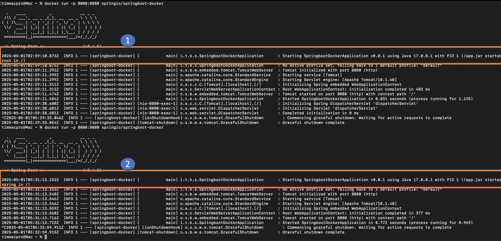

## 前言

基本上只要是 Container-Base 的服務，都可以拿來讓 Kubernetes Pod 部署，並且不僅限於 Docker Container，只是現代容器趨勢依舊是被 Docker 掌握，加上他的方便性與穩定性，所以本篇將使用 Spring Boot 程式碼建立出一個簡易的 API Server，並使用 Docker 將此 API Server 建構為容器，作為可部署至Kubernetes 的簡單容器．

## 目錄與步驟

1. [步驟 1：使用 Spring Initializr 建立 Spring Boot Project](#步驟-1使用-spring-initializr-建立--spring-boot-project)
2. [步驟 2：設定 Spring Boot 應用程式](#步驟-2設定-spring-boot-應用程式)
3. [步驟 3 ：容器化 「它」](#步驟3-容器化-它)
4. [步驟 4：執行容器](#步驟-3-容器化-它)
5. [延伸步驟 5：建立使用者運行容器內的應用程式](#延伸步驟-5建立使用者運行容器內的應用程式)

## 詳細流程

### 步驟 1：使用 Spring Initializr 建立  Spring Boot Project

手動初始化Spring Boot 專案：
1. 導覽至 [Spring Boot Initializr](https://start.spring.io)．該服務引入了應用程式所需的所有依賴項，並為您完成大部分設定。
2. 選擇 Maven 以及您想要使用的語言。本篇指南將以Java 為例。
3. 點擊 **“依賴項”** 並選擇 **“Spring Web”**。
4. 按一下 **“生成”**。
5. 下載生成的 ZIP 文件，它是根據您的選擇配置的 Web 應用程式的存檔。

| 筆記  | 如果您的 IDE 具有 Spring Initializr 集成，您可以從 IDE 完成此過程。 |
| --- | ------------------------------------------------ |

### 步驟 2：設定 Spring Boot 應用程式

建立應用程式 SpringBootDockerApplication.java，參考範例如下

~~~ java
package idv.tim.k8s.springbootdocker;  
  
import org.springframework.boot.SpringApplication;  
import org.springframework.boot.autoconfigure.SpringBootApplication;  
import org.springframework.web.bind.annotation.RestController;  
import org.springframework.web.bind.annotation.RequestMapping;  
  
@RestController  
@SpringBootApplication  
public class SpringbootDockerApplication {  
  
    @RequestMapping("/")  
    public String home() {  
        return "Hello Docker World";  
    }  
  
    public static void main(String[] args) {  
        SpringApplication.run(SpringbootDockerApplication.class, args);  
    }  
  
}
~~~

該類別被標記為`@SpringBootApplication`和`@RestController`，這意味著它可供 Spring MVC 用來處理 Web 請求。`@RequestMapping`映射`/`到`home()`發送`Hello World`回應的方法。該`main()`方法使用 Spring Boot 的`SpringApplication.run()`方法來啟動應用程式。

現在我們可以在沒有 Docker 容器的情況下運行應用程式（即在主機作業系統中）：

執行以下命令：

| 命令  | ./mvnw package && java -jar target/springboot-docker-0.0.1.jar |
| --- | -------------------------------------------------------------- |
然後到[localhost:8080](http://localhost:8080/)查看「Hello Docker World」訊息。

### 步驟 3 ：容器化 「它」

Docker has a simple ["Dockerfile"](https://docs.docker.com/reference/builder/) file format that it uses to specify the “layers” of an image. Create the following Dockerfile in your Spring Boot project:

Docker 有一個簡單的[「Dockerfile」](https://docs.docker.com/reference/builder/)檔案格式，它用於指定映像的「層」。在您的 Spring Boot 專案中建立以下 Dockerfile：

~~~ DockerFile
FROM azul/zulu-openjdk-alpine:17.0.8  
ARG JAR_FILE=target/*.jar  
COPY ${JAR_FILE} app.jar  
ENTRYPOINT ["java","-jar","/app.jar"]
~~~

這個 Dockerfile 非常簡單，但它是運行 Spring Boot 應用程式所需的全部內容：只需 Java 和一個 JAR 檔案。然後透過`COPY`命令將專案中的 JAR 檔案複製進容器中`app.jar`，並在中運行`ENTRYPOINT`。使用Dockerfile的陣列形式，`ENTRYPOINT`這樣就沒有shell包裹Java進程。
It is then copied (by the `COPY` command) the project JAR file into the container as `app.jar`, which is run in the `ENTRYPOINT`. The array form of the Dockerfile `ENTRYPOINT` is used so that there is no shell wrapping the Java process.

使用以下命令運行 Dockerfile

| 命令  | docker build -t springio/springboot-docker . |
| --- | -------------------------------------------- |
This command builds an image and tags it as `springio/springboot-docker`．

此命令建立一個Docker 映像檔並將其標記為`springio/springboot-docker`。

### 步驟 4：執行容器

使用以下命令運行建置完成的容器 Docker Image

| 命令  | docker run -p 8080:8080 springio/springboot-docker |
| --- | -------------------------------------------------- |

### 延伸步驟 5：建立使用者運行容器內的應用程式

以使用者權限執行應用程式有助於減輕一些風險（例如，請參閱[StackExchange 上的一個貼文](https://security.stackexchange.com/questions/106860/can-a-root-user-inside-a-docker-lxc-break-the-security-of-the-whole-system)）。因此，一個重要的改進`Dockerfile`是以非 root 使用者身分執行應用程式：

~~~ Dockerfile

FROM azul/zulu-openjdk-alpine:17.0.8  
RUN addgroup -S spring && adduser -S spring -G spring  
USER spring:spring  
ARG JAR_FILE=target/*.jar  
COPY ${JAR_FILE} app.jar  
ENTRYPOINT ["java","-jar","/app.jar"]

~~~

該 Dockerfile 多建立一個 spring 使用者和一個 spring 群組來運行該應用程式。

參考下圖，重新執行容器後，執行容器內 app.jar 的使用者已經從 root 調整為 spring

## 參考資料

+ [Spring Boot with Docker](https://spring.io/guides/gs/spring-boot-docker)
+ [從異世界歸來的第六天 - Kubernetes 三兄弟 - 實戰做一個 Pod (一)](https://ithelp.ithome.com.tw/articles/10288199?sc=iThelpR)